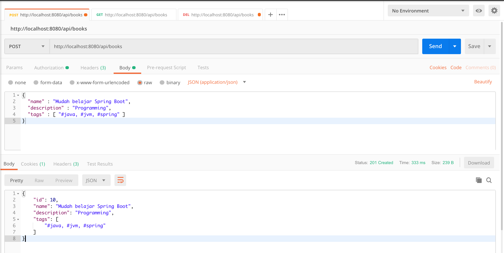
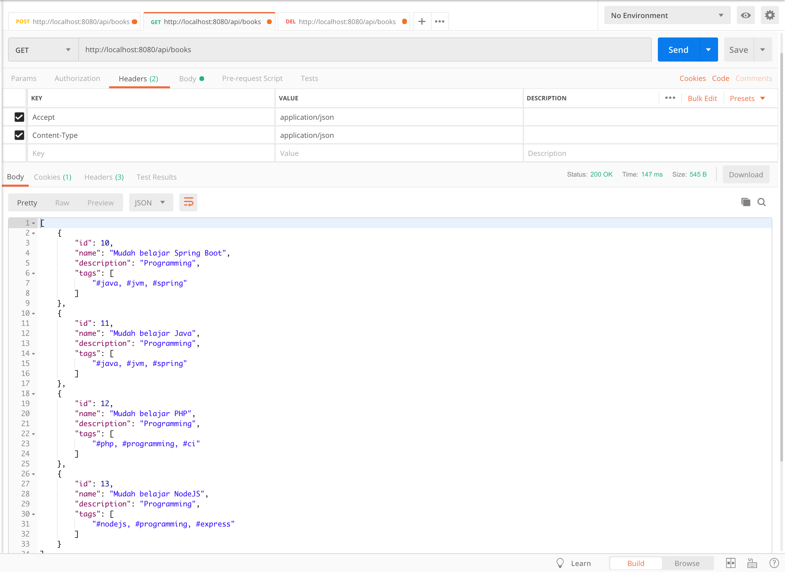
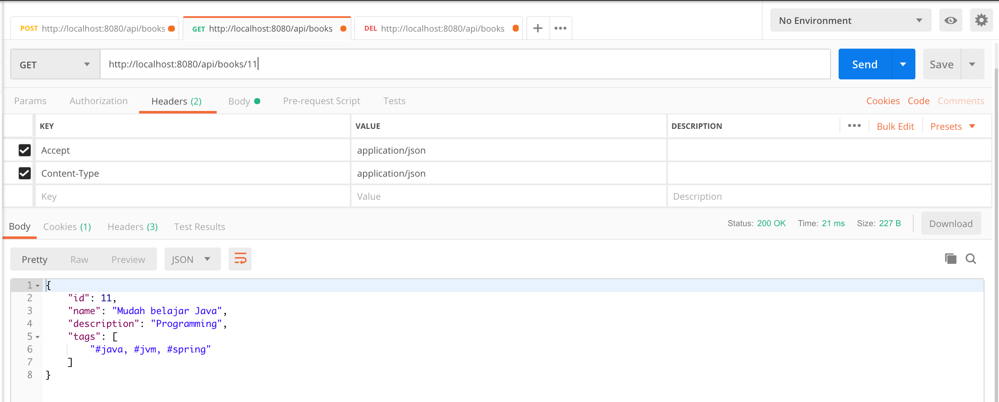
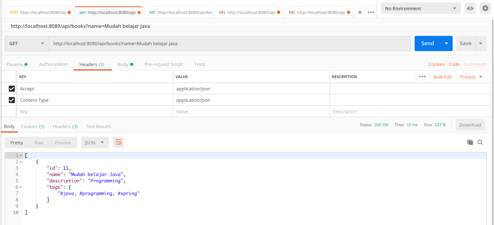
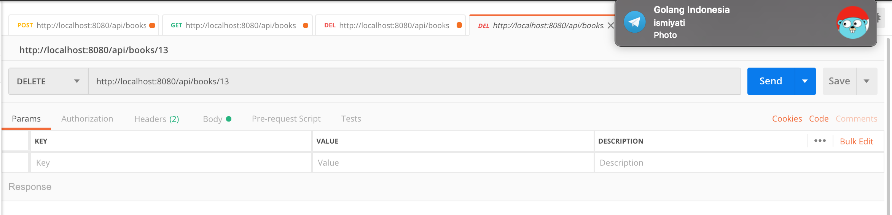
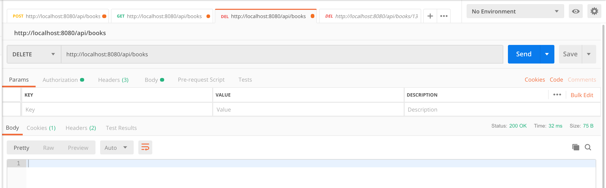

# spring-boot-rest-api-postgresql

### Plain REST API CRUD with Spring Boot and PostgreSQL.

Technology stack:

* Spring Boot;
* Spring Web;
* Spring Data;
* PostgreSQL database;
* Hibernate;
* Spring Security (as basic authentication).

#### To run this application use:

`mvn clean spring-boot:run`

#### The view in the Postman:

Add new Book/Author

`POST /api/books`
`POST /api/authors`

http://localhost:8080/api/books

Get All Books/Authors

`GET /api/books`
`GET /api/authors`

http://localhost:8080/api/books

Get Book/Author By Id

`GET /api/books/{id}`
`GET /api/authors/{id}`

http://localhost:8080/api/books/{id}

Get Book/Author By Name

`GET /api/books?name=name`
`GET /api/authors?name=name`

http://localhost:8080/api/books?name=name

Delete Book/Author By Id

`DELETE /api/books/{id}`
`DELETE /api/authors/{id}`

http://localhost:8080/api/books/{id}

Delete All Books/Authors

`DELETE /api/books`
`DELETE /api/authors`

http://localhost:8080/api/books

/////////////
To view logs go at "myapp.log"

kubectl config current-context -- To view your current context
kubectl config get-contexts -- To list all your contexts
kubectl config use-context my-context -- To switch to a different context:
